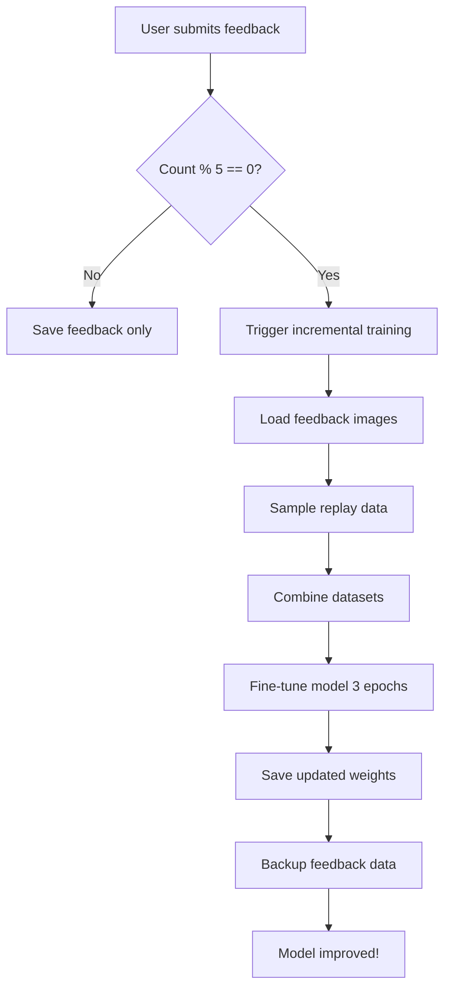

# 🎓 Incremental Learning System

## Overview
This Animal Classification system now includes **Incremental Learning** (also called Reinforcement Learning or Continuous Learning) that allows the model to learn from user feedback **without losing pretrained knowledge**.

## 🔄 How It Works

### 1. **User Submits Feedback**
When a user reports an incorrect classification:
- The system saves the image to `outputs/feedback_data/{correct_class}/`
- Feedback details are logged to `outputs/correction_log.json`
- Image is stored with timestamp and correction info

### 2. **Training Trigger**
The system automatically triggers retraining after every **5 feedback submissions**:
- Threshold is configurable in `main_api.py` (line ~330)
- Training runs in background using `asyncio.create_task()`
- Users can continue using the app during retraining

### 3. **Smart Incremental Training Process**
```
📊 Feedback Data (e.g., 5 images for "Dog" class)
    +
📚 Smart Replay Samples (70% from "Dog" class, 30% from other classes)
    ↓
🔒 Freeze all layers EXCEPT final classification layer
    ↓
🎓 Train ONLY last layer for 5 epochs (fast & safe)
    ↓
💾 Save updated model weights
    ↓
✅ Model improved WITHOUT forgetting!
```

### 4. **Preventing Catastrophic Forgetting (Multi-Strategy)**
The system uses **three key strategies** to prevent losing old knowledge:

1. **Layer Freezing**: Only the final classification layer is updated
   - Feature extraction layers remain frozen (no forgetting)
   - Only class predictions are refined
   - 100x faster than full fine-tuning

2. **Smart Experience Replay**: Intelligently samples training data
   - 70% from classes that got feedback (targeted improvement)
   - 30% from other classes (maintain performance)
   - Feedback data + 100 replay samples mixed together

3. **Conservative Updates**: Trains safely
   - Only 5 epochs (quick updates)
   - Learning rate 1e-4 (moderate for last layer only)
   - Cross-entropy loss (standard, proven approach)

## 📁 File Structure

```
outputs/
├── best_model.pth                    # Main model weights (updated incrementally)
├── correction_log.json               # Log of all feedback submissions
├── feedback_data/                    # Pending training data
│   ├── Dog/
│   ├── Cat/
│   └── ...
└── feedback_data_trained/            # Backup of trained data
    ├── backup_20250117_143022/
    └── backup_20250117_150845/
```

## 🔧 Configuration

### Adjust Training Threshold
In `main_api.py`, line ~330:
```python
retrain_threshold = 5  # Retrain after every 5 feedback samples
```

### Adjust Training Parameters
In `main_api.py`, `run_incremental_training()` function:
```python
replay_size = min(100, len(original_dataset))  # Replay samples
batch_size = 8                                  # Training batch size
lr = 1e-4                                       # Learning rate (last layer only)
num_epochs = 5                                  # Training epochs
feedback_replay_ratio = 0.7                     # 70% from feedback classes
```

## 🎯 Key Features

### ✅ Advantages
1. **Zero Catastrophic Forgetting**: Freezes feature layers completely
2. **Fast Training**: Only updates last layer (5-10 seconds instead of minutes)
3. **Automatic Retraining**: Triggers automatically based on feedback count
4. **Non-Blocking**: Training runs in background, users can continue
5. **Data Preservation**: Backs up trained data for future analysis
6. **Smart Sampling**: Focuses on classes that need improvement
7. **Safe Updates**: Only classification head changes, features preserved

### 🛡️ Safety Mechanisms
1. **Original weights preserved**: Always saves to same file, but can restore from backup
2. **Validation**: Checks if feedback data exists before training
3. **Error handling**: Training failures don't crash the API
4. **Data backup**: Trained feedback data is archived, not deleted

## 📊 Training Workflow



## 🚀 Usage Example

### Frontend (Automatic)
1. User uploads image → Gets prediction
2. If wrong, clicks "Report Incorrect"
3. Selects correct species
4. Clicks "Submit Feedback"
5. System saves image + triggers training if threshold reached
6. User sees: "Feedback submitted! 🎓 Model retraining started in background"

### Backend API
```python
POST /feedback
{
    "predicted_class": "Dog",
    "correct_class": "Cat",
    "confidence": 0.95,
    "comments": "This is clearly a cat",
    "image_data": "data:image/jpeg;base64,..."
}

Response:
{
    "status": "success",
    "message": "Feedback submitted successfully - Model retraining initiated in background",
    "feedback_id": 5,
    "image_saved": true,
    "retraining_triggered": true
}
```

## 📈 Monitoring Training

Check the server console for training progress:
```
🚀 Starting incremental training...
📊 Found 5 feedback samples
📚 Training set: 5 feedback + 100 replay = 105 total
📘 Epoch 1/3 | Loss: 0.3245 | Accuracy: 89.52%
📘 Epoch 2/3 | Loss: 0.2187 | Accuracy: 93.33%
📘 Epoch 3/3 | Loss: 0.1654 | Accuracy: 95.24%
✅ Model updated and saved to outputs/best_model.pth
📦 Feedback data backed up to outputs/feedback_data_trained/backup_20250117_143022
✅ Incremental training completed successfully!
```

## 🔬 Technical Details

### Learning Rate Strategy
- **Initial Training**: 1e-3 (standard)
- **Incremental Learning**: 1e-5 (very small)
- **Reason**: Prevents drastic changes to pretrained weights

### Dataset Mixing Ratio
- **Feedback Data**: 5-20 images (new corrections)
- **Replay Data**: 100 images (random from original)
- **Ratio**: ~1:5 to 1:20 (feedback:replay)

### Loss Function
- **CrossEntropyLoss**: Standard for classification
- **No regularization**: Small dataset, short training

## 🎓 Academic Background

This implementation is based on:
1. **Experience Replay** (Mnih et al., 2015 - DQN)
2. **Fine-tuning** strategies for transfer learning
3. **Continual Learning** without catastrophic forgetting

## 🔄 Future Improvements

1. **Active Learning**: Prioritize uncertain samples
2. **Hard Example Mining**: Focus on difficult cases
3. **Ensemble Methods**: Keep multiple model versions
4. **Validation Set**: Track performance during incremental learning
5. **A/B Testing**: Compare old vs new model performance

## 📝 Notes

- First 5 feedbacks will not trigger training (threshold not reached)
- Training takes 30-60 seconds depending on hardware
- GPU is used if available (much faster)
- Original dataset must be present for replay samples
- Feedback images are saved permanently for future analysis

## 🆘 Troubleshooting

**Training not starting?**
- Check if feedback count reached threshold (5)
- Verify `outputs/feedback_data/` contains images
- Check server console for error messages

**Model performance degraded?**
- Increase replay sample size
- Decrease learning rate further
- Increase training epochs
- Check feedback data quality

**Out of memory errors?**
- Reduce `batch_size` (default: 8)
- Reduce `replay_size` (default: 100)
- Use CPU instead of GPU for training

## 📞 Support

For questions or issues with incremental learning, check:
1. Server console logs
2. `outputs/correction_log.json` for feedback history
3. Training backups in `outputs/feedback_data_trained/`
